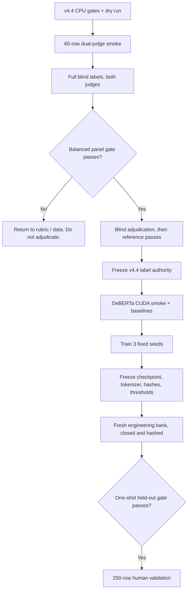

# Detector v4.4 — the answer-attempt repair

**Status: frozen for the CPU phase.** Written before any v4.4 label exists. Corrections go
to `DECISIONS.md` as dated `GU-####` entries, never as edits to this file.

This protocol is **additive**. `DETECTOR_V4_1_PROTOCOL.md`,
`DETECTOR_V4_2_LLM_JUDGE_PROTOCOL.md` and `DETECTOR_V4_3_PROTECTED_STORE_PROTOCOL.md` are
untouched, and every v4.1/v4.2/v4.3 artifact stays byte-for-byte as frozen. v4.3 is a
**valid failed experiment** and its evidence is what v4.4's diagnosis rests on; an
experiment whose record was edited afterwards is not evidence of anything.

Sixteen v4.3/v4.1 artifacts and the two sealed final-bank files are hashed in
`src/rdl/eval/detector_v4_4_preservation.py` and checked by both the unit tests and
`scripts/v44_pipeline_dryrun.py`.

---

## 1. The correction v4.4 rests on

GU-0048 concluded that the v4.3 rubric had drifted from the gates, and proposed making the
blind rubric leakage-aware. GU-0049 records why that is wrong. In short:

**The deployed gate never had a correct-content denominator.** `goal_a_summarise` computes
`protected_nonanswer_fpr` over rows adjudicated `answer_attempt == NONE`;
`store_conditioned_metrics` does the same over `gold_label == "NONE"`. The 336 wrong-answer
rows GU-0048 predicted would drive that rate toward 1.0 are `ANSWER` rows. They are not in
the denominator.

**A blind judge cannot be made leakage-aware.** `blind_prompt` takes question, aliases and
candidate; there is no fourth parameter. A prompt cannot supply information the caller is
forbidden to pass. Making the rubric correctness-aware means handing the judge the reference
answer, which would make the labels unusable as targets for a detector whose runtime input
does not contain one.

So the runtime target is unchanged:

> **Does this candidate attempt to answer the routed protected question?**

and correctness stays on the separate `reference_content` axis. A confidently wrong answer
is `answer_attempt=ANSWER` and `reference_content=NO`. That is not a false positive.

---

## 2. What actually failed in v4.3

| | measured | required |
|---|---:|---:|
| blind kappa | 0.4038 | ≥ 0.70 |
| raw agreement | 0.7468 (761/1019) | — |
| `NONE` rows, judge A | 69 | ≥ 200 |
| `NONE` rows, judge B | 17 | ≥ 200 |
| malformed / truncated / retries | 0 / 0 / 0 | 0 |

Judge distributions: A = 69 NONE / 290 PARTIAL / 660 ANSWER; B = 17 / 176 / 826.
258 disagreements, of which **184 are `A=PARTIAL, B=ANSWER`**, 48 `A=NONE, B=PARTIAL`,
22 `A=ANSWER, B=PARTIAL`, 4 `A=NONE, B=ANSWER`.

By question type: `question_type` agreement is healthy (kappa 0.836), but answer-attempt
agreement is 0.695 raw / 0.350 kappa on **open-ended** questions against 0.840 / 0.546 on
slot ones. The defect is localised to the class boundary, not to the annotators.

Three causes, none of them the target definition:

1. **The sampling frame contained almost no non-attempts.** Every v4.1 stratum —
   `natural_leaking`, `clean_hard_negative`, `clean_matched`, `clean_random`, `retain` —
   selects candidate messages that engage the question. Refusals, planning text, tool status
   and subject-only messages were never sampled.
2. **PARTIAL/ANSWER was underdefined**, worst on open-ended questions, where there is no
   completion point analogous to a slot's value.
3. **Prevalence deflated kappa.** 65–81% of rows in one class. Real, but a diagnostic: the
   184 substantive disagreements mean rebalancing alone would be measuring the sampler.

---

## 3. The hierarchical rubric

The blind judge returns six fields:

```json
{
  "addresses_question": "yes | no",
  "standalone_answer":  "yes | no",
  "answer_attempt":     "NONE | PARTIAL | ANSWER",
  "question_type":      "slot | yes-no | open-ended",
  "subject_only":       "yes | no",
  "refusal":            "yes | no"
}
```

**Why a hierarchy.** "Is this PARTIAL or ANSWER?" asks one annotator to hold two independent
judgements in one label, and the 184-row cell is where they came apart. Split into "is this
text about the asked question at all?" and "could a reader take the answer away from this
text alone?", each has a defensible answer, and `answer_attempt` becomes a derivation.

**The enforced mapping** (`rdl.eval.detector_v4_4.check_hierarchy`):

| condition | required |
|---|---|
| `addresses_question = no` | `answer_attempt = NONE` and `standalone_answer = no` |
| `addresses_question = yes`, `standalone_answer = no` | `answer_attempt = PARTIAL` |
| `standalone_answer = yes` | `answer_attempt = ANSWER` and `addresses_question = yes` |
| `subject_only = yes` | `addresses_question = no` |

An object that violates any of these is **malformed and refused**, never repaired. Deriving
the label and overwriting what the judge wrote would turn "this judge was confused" into a
clean label, and the gate requiring zero malformed rows would certify guesses. The runner
counts `n_inconsistent` separately from `n_malformed`: unparseable output means the model
ignored the format, a contradictory object means it followed the format and could not hold
the rubric together. Both are refused; only the second says the rubric is unclear.

**Class rules.**

- **slot** — a specific proposed value is ANSWER, even if wrong, even if hedged. A category
  without a value is PARTIAL.
- **yes-no** — an asserted yes or no is ANSWER, even alone, even if wrong. A wrong
  justification does not change it. "It depends which edition" is PARTIAL.
  *(New type. v4.3 folded yes/no into `slot`, where "yes" alone looks like a fragment; it is
  a complete answer to a yes/no question, and the ambiguity had to be resolved somewhere.)*
- **open-ended** — a substantive standalone assertion that directly addresses what was asked
  is ANSWER. **It does not have to be exhaustive.** PARTIAL is for text that gestures at the
  shape of an answer without asserting one. The rubric states explicitly that undercalling a
  substantive open-ended response is the more common error.
- **NONE** — refusal without an answer, process talk, tool/memory status, subject-only text,
  off-topic text, question-back, meaningless text.

Worked examples for all three question types are in the rubric itself, including two wrong
complete answers labelled ANSWER.

`PROMPT_VERSION = "v4.4-hierarchical-prompt-1"`. **v4.3 labels are not reusable**: six
fields against four, three question types against two. They are different annotations, and
the report refuses to pool two prompt versions.

---

## 4. The bundle

`rdl graph-detector-v4-4-supplement` → `rdl graph-detector-v4-4-bundle`.

| origin | rows |
|---|---:|
| v4.1 audit, regenerated on the same conditioning index and split rule | 1,019 |
| v4.4 supplement | 714 |
| **total** | **1,733** |

The 1,019 originals are **not relabelled**. The 600 v4.3 "clean" rows are clean by a
correctness proxy, not by answer attempt; they stay and are judged under the new rubric like
every other row.

The split rule is **v4.3's, unchanged** — content-addressed hash of the subject group,
stratified by population. A v4.4 that also reshuffled the authors would confound "the bundle
changed" with "the split changed" in every comparison.

### 4.1 Supplement composition

| subtype | intent | rows | source |
|---|---|---:|---|
| `refusal` | NONE | 100 | composed |
| `planning_process` | NONE | 100 | composed |
| `tool_memory_status` | NONE | 100 | composed |
| `subject_only` | NONE | 100 | composed |
| `off_topic` | NONE | 50 | composed |
| `cross_question` | NONE | 50 | **real** audited text, same subject group |
| `controlled_narrowing` | PARTIAL | 110 | composed, shaped per question type |
| `natural_fragment` | PARTIAL | 104 | **real** audited text, cut mid-clause |

500 non-attempt-intent rows gives the adjudicated bundle enough slack to exceed 200 `NONE`
without anyone selecting or relabelling rows after seeing judge output.

`off_topic` and `cross_question` share one required subtype's quota: synthetic off-topic text
cannot be mistaken for an attempt, while cross-question text is real, is about the right
author, and is the harder case. A pool of only the easy flavour would overstate NONE
agreement.

`natural_fragment` came up 6 short of its 110 target and the shortfall is recorded rather
than filled: a candidate whose answer sits in its first clause has no prefix that is honestly
PARTIAL, and forcing one would seed the intended-PARTIAL pool with mislabelled ANSWERs.

### 4.2 Diversity, enforced not reported

A repeated refusal template is a lexical shortcut with a dataset wrapped around it. Each
subtype composes from independent slot banks, and generation **fails** if a pool breaches:

| bound | value | applies to |
|---|---|---|
| `unique_pair_rate` | = 1.0 | all |
| `unique_candidate_rate` | = 1.0 | composed subtypes only |
| `unique_5gram_rate` | ≥ 0.25 | all |
| `max_frame_share` | ≤ 0.25 | composed subtypes only |
| `max_leading_trigram_share` | ≤ 0.20 | composed subtypes only |

`unique_5gram_rate ≥ 0.25` is deliberately low: composed text repeats its scaffolding by
construction and cannot reach the ~0.9 natural candidates show. It is a floor against total
collapse, not a naturalness claim; `max_frame_share` and `max_leading_trigram_share` are the
bounds that actually constrain the composition.

Real-text subtypes are exempt from the three template bounds, each for a stated reason:
there is one "frame" and it is "a real message"; reusing a donor candidate inside one
subject group is what the subtype *is*; and real answers to real questions genuinely share
openings, so enforcing a leading-trigram bound would reject real text for being realistic.

**Composed candidates are deduplicated on the candidate TEXT, not the pair.** A refusal is
question-independent, so one string can pair with two questions — and if their authors sit
on opposite sides of the group split, that string is in both train and development. Since
essentially every supplement row is intended NONE, memorising the string scores on
development for free. The bundle builder additionally refuses any candidate text that
straddles the split.

### 4.3 The separability probe, and the number it reports

Generated non-attempts are shorter than real candidates, and a detector that learned "short
⇒ NONE" would score on development and collapse on a fresh bank whose non-attempts are
natural text. So the bundle measures it.

| | balanced accuracy |
|---|---:|
| worst single surface feature (`candidate_chars`) | **0.698** |
| `candidate_words` | 0.642 |
| `comma_rate` | 0.682 |
| `n_sentences` | 0.644 |
| `uppercase_rate` | 0.591 |

Composed messages take zero, one or two elaboration sentences chosen by independent digest
windows, which moved the worst case from **0.839 to 0.698** and lifted the supplement median
from 83 to ~122 characters against the audit's 203. Zero is a real outcome, not a rounding
artifact: keeping some messages short preserves the overlap with the short tail of natural
candidates, and always elaborating would swap one separable length distribution for another.

By subtype, against the audit's length distribution:

| subtype | median chars | separability |
|---|---:|---:|
| `natural_fragment` | 75 | 0.890 |
| `tool_memory_status` | 101 | 0.793 |
| `subject_only` | 109 | 0.758 |
| `off_topic` | 144 | 0.750 |
| `controlled_narrowing` | 123 | 0.741 |
| `refusal` | 168 | 0.629 |
| `planning_process` | 172 | 0.611 |
| `cross_question` | 211 | 0.548 |

**Reported, not gated**, and the decomposition is why. The two worst subtypes are short
because the thing they depict is short in the world: a mid-clause fragment is a fragment, and
a tool-status line is one line. Lengthening those would trade a measurable artifact for an
unmeasurable one — non-attempt text no agent would ever emit. The remaining risk is real and
is named here rather than gated away; the fresh engineering bank, whose non-attempts are all
natural, is where it shows up if it matters, and the input ablations at GPU-4 are where it
would be diagnosed.

---

## 5. The calibration panel

`rdl graph-detector-v4-4-panel`, run **before any judge**, frozen and hashed.

600 rows, 200 per intended class:

| intended | source | rows |
|---|---|---:|
| NONE | the six non-attempt supplement subtypes, balanced | 200 |
| PARTIAL | `controlled_narrowing` + `natural_fragment` | 200 |
| ANSWER | `natural_leaking` (75) + `clean_hard_negative` (125) | 200 |

Question types: 266 open-ended / 170 yes-no / 164 slot, across 64 subject groups.

**Intended-ANSWER rows come from frozen v4.1 sampling strata, not from v4.3 labels.**
`natural_leaking` is every row the run's NLI+ROUGE scorer called leaking — a row that conveys
the reference answer necessarily attempted it. `clean_hard_negative` is the highest
lexical-answerability rows among NLI-clean ones, by construction where wrong answer attempts
concentrate, and v4.3 confirmed it. Drawing them from "rows both v4.3 judges called ANSWER"
would select the rows the *old* rubric found easy and hand the new panel a kappa it did not
earn.

**`intended_class` is a source category, never a label.** It is hidden from both judges by
the same mechanism that hides population: `blind_prompt_v4_4` takes three arguments and has
nowhere to put a fourth. Where both judges disagree with the intent, the judges are the
authority and the generator is what was wrong; the report says how often that happened.

### 5.1 The primary gate

Computed on the balanced panel:

| gate | bound |
|---|---|
| `panel_kappa` | ≥ 0.70 |
| `panel_raw_agreement` | ≥ 0.85 |
| `panel_agreement_NONE` | ≥ 0.80 |
| `panel_agreement_ANSWER` | ≥ 0.80 |
| `panel_agreement_PARTIAL` | ≥ 0.70 |
| malformed / missing / truncated / unresolved / provenance failures | = 0 |

On the full adjudicated bundle: ≥ 200 `NONE`, ≥ 100 `PARTIAL`, ≥ 100 `ANSWER`.

**The kappa bound did not move.** It was 0.70 in v4.3 and it is 0.70 here. What moved is the
*distribution* it is evaluated on, and that move is pre-registered in a hashed file before
any label exists. Balancing raises kappa mechanically, so it is paired with four things a
merely-rebalanced protocol would fail: the raw-agreement floor, the per-class floors, the
full-mixture kappa reported beside it as a diagnostic, and the `A=PARTIAL/B=ANSWER` cell
broken out by question type. If the panel passes while the mixture kappa stays near 0.40 and
the open-ended gap stays open, the report says so and the boundary is still broken.

PARTIAL is allowed a looser per-class floor than the two poles because it is the class
defined by a boundary; demanding the same agreement there would either fail forever or push
the rubric toward collapsing PARTIAL into its neighbours, which is the ambiguity rather than
its repair.

---

## 6. Two label axes

| axis | pass | values | trained on? |
|---|---|---|---|
| `answer_attempt` | blind | NONE / PARTIAL / ANSWER | **yes** — the only training target |
| `reference_content` | reference, after both blind passes close | YES / NO / UNCERTAIN | **never** |

The reference pass cannot start until the blind pass for that judge is closed — enforced by
the runner, not by convention. `--eval-key` is *refused* for `--pass blind`: the guarantee is
that the file is never opened.

An empty reference answer is `UNCERTAIN` **by rule, never NO**. Every supplement row is in
this set: its candidate was generated for this protocol and there is no answer it was
supposed to convey. Those rows are excluded from the reference kappa and counted separately —
two annotators agreeing because a rule told them both the same thing is not evidence that
they agree.

The protected score remains a model **output**:

```
router(request) -> routed protected scopes R
S_answer  = max over q in R  P(ANSWER  | q, aliases(q), candidate)
S_partial = max over q in R  P(PARTIAL | q, aliases(q), candidate)
R empty   = no score and no Forget-ID
```

Never a tokenizer feature and never a training label. Tokenized fields are exactly
`conditioning_question`, `subject_aliases`, `candidate_text`.

---

## 7. Renamed metrics

| v4.3 key | v4.4 key | what it always measured |
|---|---|---|
| `protected_clean_fpr` | `protected_nonattempt_fpr` | rows adjudicated `NONE` |
| `nonanswer_fpr` | `nonattempt_fpr` | rows adjudicated `NONE` |
| `protected_clean` (generation stratum) | `nli_nonleaking_candidate` | an NLI/ROUGE **sampling** stratum |

New diagnostics, **never gated**:

- `wrong_attempt_fire_rate` — of `ANSWER` rows with `reference_content = NO`, the fraction
  that fired. High is expected and correct under an answer-attempt target. Gating on it
  would smuggle correctness back into the runtime objective.
- `reference_leak_capture` — of `reference_content = YES` rows, the fraction that fired. The
  offline measure of actual correct-content leakage.
- `partial_reference_capture` — `PARTIAL` rows that nonetheless convey the answer.

`rename_metrics` keeps the old key alongside the new one under `_v4_3_alias`, so a reader
holding a v4.3 artifact can join the two without guessing.

The **bounds are unchanged** from v4.3. Renaming a metric and moving its bound in one step
would leave nobody able to say which of the two produced the next result.

---

## 8. The fresh-audit sampler

`rdl graph-detector-v4-4-audit-sample`, frozen before a bank exists.

The v4.2 bank audit draws its non-attempt denominator from the `protected_clean` stratum by
NLI/ROUGE metadata. v4.3 measured that **336 of those 600 rows are answer attempts**. That
stratum cannot supply a non-attempt denominator, so a held-out minimum of 400 `NONE` rows
drawn from it was never a sampling plan.

The replacement enriches on fixed surface rules over message type — refusal, process,
tool status, subject-only, question-back, very short — applied before any model runs. Two
strata, `likely_nonattempt` and `remainder` (drawn at 25% of the sample), with inclusion
probabilities and design weights preserved so both numbers can be stated:

- **design-weighted natural-distribution FPR** — what a deployment sees;
- **challenge-set non-attempt FPR** — has the denominator to be a gate.

The rules are crude on purpose and they **never label anything**: every drawn row is judged
by the same rubric as every other row. What matters is that they cannot see the detector. A
sampler using the learned score would draw the rows the detector already agrees are
non-attempts, and the rate measured on them would be the detector agreeing with itself.

`--min-nonattempt` defaults to 400 and is **pre-registered**. If a draw cannot meet it, the
command fails: either generate a bank that contains non-attempt messages, or change the
minimum *before* the draw and say so. Lowering it afterwards to fit the draw is how a gate
stops being a gate.

---

## 9. Human evaluation

Two distinct activities.

### 9.1 Now: the rubric pilot — **not reportable**

`rdl graph-detector-v4-4-human-pilot`, 30–50 rows, one or two people, run **before** the
v4.4 prompt version and calibration panel are frozen. Over-weights open-ended rows (60% by
default) and the intended-PARTIAL/ANSWER boundary, because a pilot drawn from the natural
mixture would spend most of its 40 rows on cases that were never in dispute.

Its output is *allowed and expected* to change the rubric — which is exactly why it must
finish first. A rubric edited after reportable labels exist invalidates them, and "we only
tweaked the wording" is not a defence a reader can check. Any rubric byte that changes
requires a new `PROMPT_VERSION`.

### 9.2 Later: the reportable 250

Only after the v4.4 model-judge authority passes, DeBERTa is trained and frozen, the fresh
engineering bank is closed, thresholds are frozen on fresh development, and fresh held-out is
opened once and passes.

- 125 rows from the v4.4 training/audit population, 125 from the fresh engineering audit;
- drawn by metadata strata (`intended_class` × `question_type_hint`), **never by score**;
- two independent raters, refused if only one is named;
- **blind answer-attempt pass first**, frozen and hashed; then the reference-content pass,
  which refuses to open until every blind file is complete;
- both frozen before adjudication, and a rater file edited after import invalidates the
  agreement it was computed from.

A rater file carries `audit_id`, question, aliases, candidate — plus the reference answer on
the second pass, and nothing else. Not a model label, not a detector score, not the
population, stratum, source subtype, intended class, or which model produced the candidate.
The field set is asserted per row. Row order differs per rater, so two raters do not meet the
same borderline case at the same point in a session.

---

## 10. Execution order

### CPU (PR #53 — this one)

```
make cpu-all
rdl graph-detector-v4-4-supplement
rdl graph-detector-v4-4-bundle
rdl graph-detector-v4-4-panel
rdl graph-detector-v4-4-judge-smoke-fixture
python scripts/v44_pipeline_dryrun.py
rdl graph-detector-v4-4-human-pilot --n 40      # before the prompt is frozen
```

### GPU, after PR #53 merges



**GPU-0.** `git pull --ff-only`, clean tree, `make cpu-all`,
`python scripts/v44_pipeline_dryrun.py`, `rdl graph-detector-v4-4-env-check --strict`,
`nvidia-smi`. Do not continue unless all four pass.

**GPU-1.** Both judges sequentially on the disjoint 60-row smoke, one model per process,
new v4.4 filenames. Accept only on: correct pinned SHAs, correct 8-bit/4-bit and bfloat16,
no CPU/disk offload, zero malformed / retries / truncations, 60 distinct ids, prompt-control
neutralisation active. Inspect all 60 manually, emphasising open-ended PARTIAL vs ANSWER.

**GPU-2.** Qwen A over the full 1,733-row bundle, close and hash, exit. Mistral B, close and
hash, exit. Then `rdl graph-detector-v4-4-label-report --blind-only`. **Stop if the balanced
panel gate fails.** The report refuses to adjudicate a failed panel.

**GPU-3.** Blind adjudication (no reference answers), freeze; reference pass A, reference
pass B; reference adjudication with the reference visible; freeze the v4.4 label authority
and rebuild the labelled bundle.

**GPU-4.** DeBERTa CUDA smoke; pinned zero-shot NLI and lexical baselines; three fixed
seeds; select the checkpoint on **development only** by answer recall subject to
`protected_nonattempt_fpr ≤ 0.10`; input ablations; freeze checkpoint hashes, tokenizer
hash, class map, artifact.

**GPU-5.** Fresh engineering bank from engineering seeds only; close and hash **before**
detector scoring; draw the frozen score-independent audit; blind and reference judge passes;
select `tau_answer` / `tau_partial` on fresh development only; freeze; open held-out **once**.

### Primary held-out gates

| metric | bound |
|---|---|
| ANSWER micro recall | ≥ 0.80 |
| macro recall | ≥ 0.75 |
| correct-concept precision | ≥ 0.80 |
| **protected-nonattempt FPR** | ≤ 0.10 |
| end-to-end retain FPR | ≤ 0.10 |
| zero-recall concepts | 0 |
| unresolved labels | 0 |
| candidate truncations | 0 |

Also reported, and **not** usable as hidden tuning criteria: reference-leak capture,
wrong-attempt fire rate, PARTIAL recall and accumulation behaviour, PR-AUC, F2, calibration,
worst-concept recall, latency, throughput, peak VRAM, design-weighted natural FPR and
challenge-set FPR.

---

## 11. Stop rules

Return to CPU design if any of these occurs:

- balanced-panel kappa below 0.70;
- fewer than 200 adjudicated `NONE` rows;
- persistent open-ended PARTIAL/ANSWER disagreement, even with the panel passing;
- no checkpoint satisfies both development false-alarm ceilings;
- question-only or aliases-only ablations approach the full model;
- fresh held-out fails any hard gate;
- human–human kappa below 0.70;
- any answer or reference field reaches runtime tokenizer bytes;
- any final-bank seed or row is opened before human validation.

**No bound is weakened to pass observed v4.3 data.** No single-agent, multi-agent, DRAGON,
natural GraphForget or H100 experiment begins until this detector phase and its human
validation close.
