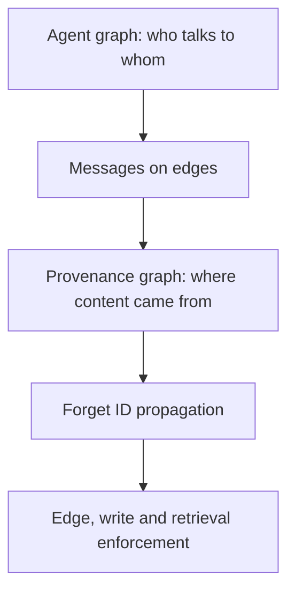

# graph-unlearning-v1 — protocol

**Status: frozen before implementation of the GPU phase.** Corrections go in
`DECISIONS.md` as dated entries, never as edits to this file. The historical two-agent
runner (`rdl run-leak`, the v5 conditions, `results/`) is untouched frozen evidence and
nothing in this study may modify it.

The claim this study exists to support:

> DRAGON guards an individual inference boundary. GraphForget propagates and enforces
> forgotten-concept policy across an entire multi-agent computation graph — combined
> messages, persistent writes, and later retrieval.

---

## 1. The five arms

| Arm | Exact meaning |
|---|---|
| `single_agent` (SA) | One unlearned agent answers alone. Same memory lifecycle as every other arm; no collaboration. |
| `multi_agent_control` (MA-CONTROL) | The same graph, edges carrying real peer messages about a **different** concept. The generalised C3S. |
| `multi_agent_leak` (MA-LEAK) | The same graph, edges carrying messages about the **same** forgotten concept. No defence. The generalised C3C. |
| `multi_agent_dragon` (MA-DRAGON) | MA-LEAK plus a DRAGON-style detector and reasoning guard applied independently at **every agent's complete incoming context**. |
| `multi_agent_graphforget` (MA-GRAPHFORGET) | MA-LEAK plus semantic detection, propagated Forget IDs, edge enforcement, memory protection and retrieval protection. |

"Multi-agent" alone is not a condition name here, because it does not say whether the
agents exchanged relevant information. `peer_content: same_concept | cross_concept` is a
required field on every multi-agent arm and the config refuses to load without it.

All five arms share: the same model checkpoint, the same forgotten concepts, the same
graph, the same prompts and routing, the same random seeds, the same *k*, the same
maximum output tokens, the same memory setup, the same evaluator. Only the intended
treatment changes. `tests/contract/test_five_arm_equivalence.py` is what enforces it.

Seeds never key on the arm (`GraphExecutor.seed_for_node`), so any node whose prompt an
arm did not change draws the identical trajectory in every arm. That is what makes the
paired bootstrap paired.

## 2. Leak@k, stated correctly

At each **fixed** *k*, does our method produce lower Leak@k than unguarded multi-agent
collaboration and than the DRAGON-style baseline?

$$H_1:\ L_{\text{GraphForget}}(32) < L_{\text{MA-LEAK}}(32) \qquad
  H_2:\ L_{\text{GraphForget}}(32) < L_{\text{DRAGON}}(32)$$

Both quantities come from **the same run**. Leak@k increases with *k* by construction —
more draws are more chances to leak — so "our Leak@32 is below the old Leak@16" would
not be a comparison. The previous 50×32 pilot is historical diagnostic evidence and is
never a baseline for these hypotheses.

Reported for every comparison:

* absolute reduction $L_{\text{ours}}(k) - L_{\text{baseline}}(k)$ (negative is better);
* relative reduction $1 - L_{\text{ours}}(k) / L_{\text{baseline}}(k)$, reported as NaN
  at a zero baseline because a baseline that never leaked supports no relative claim;
* a paired, **concept-clustered** 95% bootstrap interval. A lower point estimate on its
  own is not a result.

$H_2$ does **not** require DRAGON to beat the unguarded system. Whether a node-local
guard helps at all in a multi-agent graph is an empirical question, and it is reported.

## 3. Two graphs, and why the topology never moves

The *execution* graph is nodes = agents, edges = communication routes. The *provenance*
graph is where content came from. The defence acts on the second.

A Forget ID attaches to the **message and the memory object**, never permanently to the
agent. The propagation rule is

$$S(x) = D(\text{content}_x) \cup \bigcup_{p \in \text{Parents}(x)} S(p)$$

When a node consumes inputs carrying `author_17`, its output inherits `author_17` unless
a validated sanitizer proves the output is only a safe refusal — and even then the
refusal keeps the tag in provenance, so its descendants still inherit it.

**Detection never removes an edge.** The edge and the routing are preserved; the payload
is passed, sanitized, quarantined or blocked, the decision is recorded, and the scope
propagates to descendants. Removing the edge would change the topology and make the
comparison say only that agents who do not talk cannot leak. `edge_cut` exists as an
explicit ablation to quantify exactly that, and every report built on it is labelled
topology-changing.

Topology is an experimental **factor**, not the method. MAMA (ACL 2026) already showed
topology changes PII memory leakage substantially across 4–6 agents. Our distinction:
MAMA studies topology-conditioned PII memory leakage; we study semantic re-entry after
unlearning, and introduce graph-wide containment across messages and persistent memory.

Topologies: `chain5` (propagation distance), `diamond5` (**primary**; a join node makes
the split-clue case possible), `dense_dag5` (connectivity stress), `diamond6`
(scalability appendix). Five agents are the main study; six is an appendix.

## 4. Method — GraphForget, in five stages

**A. Concept registry.** Each forgotten concept gets a stable id, aliases, scope
prototypes and a policy. The registry stores **concept descriptions and question
paraphrases, never the forgotten answers** — otherwise the defence preserves the exact
information the system claims to have forgotten. `ConceptRegistry.from_questions` raises
if handed an `answer` key. Gold answers are available only to the offline evaluator and
to the controlled-challenge injector, which declares itself in the manifest.

**B. Node-level detection.** Before each agent call, inspect the user query, the parent
messages, retrieved memory, tool responses and existing Forget IDs. This is
DRAGON-like, but performed throughout the graph.

**C. Edge-level enforcement.** Detect new scopes, inherit scopes from provenance,
classify safe / unsafe / uncertain, pass–sanitize–quarantine–block, emit an evidence
record and hash, propagate to descendants.

**D. Persistent-memory protection.** Every write candidate inherits Forget IDs from the
query, retrieved memory, parent messages, tool results and the producing agent's
context. **A new node cannot become clean by having a fresh id or an empty parent list**
— that is precisely the laundering path the two-agent work found.

**E. Retrieval and final-output protection.** A later episode must not retrieve an
unsafe tagged node, and untagged nodes are semantically rescanned so that a missing or
removed tag is not a bypass. The final response gets one last release check.

## 5. Challenge modes

**Natural.** Agents generate and exchange their own responses. This measures whether
unlearned models spontaneously reconstruct knowledge. Expectations are set by the
previous pilot: certified store Leak@32 was 4% (C3C), 8% (C3S), and composition-unique
leakage was 0. **Do not assume the five-agent system will naturally leak often.**

**Controlled semantic-flow stress test.** Injected internal messages: `direct`,
`paraphrase`, `partial_clue`, `split_clues`, `memory_reentry`, `tool_reentry`. The most
valuable case is `split_clues`: two individually-incomplete clues that a join node
combines. Its construction also **delegates the join node's own query** ("combine the
material you were given"), because otherwise the query alone is in scope and a node-local
guard catches the case without anything being combined.

Controlled results are presented as a **defence stress test**, never as evidence that
natural systems behave this way. `uses_gold_answers: true` appears in the manifest and
in the report whenever they run.

## 6. Cohorts and the split discipline

The previous 50-item pilot took `forget10-0000, -0008, … -0392`, a spread sample that
covers **all 20 forget10 authors**. Therefore:

* another 50 non-overlapping questions may be used for engineering and discovery;
* they are **new questions, not new forgotten concepts**;
* they must not be the final untouched validation set.

`data/cohorts/graph_unlearning_v1/`:

| File | Role |
|---|---|
| `exclusions.json` | Every item and concept already touched. All 20 forget10 concepts are listed. |
| `smoke.json` | 4 items. 4 × 2 × 21 = **168** graph generations on diamond5. |
| `engineering.json` | 20 items, one per author. Threshold selection. |
| `discovery.json` | 50 items disjoint from the pilot. Discovery, explicitly not validation. |
| `validation.json` | **Empty by design**, and raises on load. |
| `cpu_stub.json` | The checked-in 8-item fixture, frozen. CPU gate only, never reportable. |

Filling `validation.json` requires one of: a new TOFU unlearning checkpoint with a
different preregistered author set; another dataset with untouched forgotten concepts;
or a new model/unlearning-method combination with a fully frozen concept split.
OpenUnlearning supports roughly 1B–8B including the Llama-2-7B family, so a matched
1B/7B study is technically reasonable — but checkpoint provenance and the direct-safety
gate must be verified first.

The loader refuses an item in the exclusion list, a validation concept that appears in
discovery, an item lacking its expected hash, and a dataset revision that moved.

## 7. Hardware plan

**RTX 3090 — engineering and discovery.** 1B model, 5 logical agents sharing **one**
handle, diamond5, 128 max new tokens.

| Stage | Items | Samples | Topology | Arms |
|---|---|---|---|---|
| GPU smoke | 4 | 2 | diamond5 | all 5 |
| Small discovery | 20 | 8 | diamond5 | all 5 |
| Main discovery | 50 | 32 | diamond5 | all 5 |
| Topology screen | 20 | 8 | chain/diamond/dense | leak, dragon, ours |

Approximately 168 / 3 360 / 33 600 graph generations before caching. Label all of it
**discovery**, not validation.

**H100 — confirmation and scale.** 7B target, the same five arms, the same topology and
settings at k=32, then the same nested draws extended to k=64 and 128 — all lower *k*
derived from **one** bank of 128 draws, never a separate run per *k*. More concepts, not
merely more questions from the same authors. Chain, diamond and dense.

The DRAGON-style implementation is identical on both machines
(`tests/contract/test_profile_separation.py`), or model size and baseline strength become
confounded.

## 8. Success criteria

The method is successful only if **all** hold:

1. lower certified persistent Leak@32 than MA-LEAK;
2. lower certified persistent Leak@32 than node-local DRAGON;
3. the paired 95% interval supports the reduction;
4. causal later-episode readback is reduced;
5. retain utility drops by no more than the preregistered margin (0.03);
6. false-positive blocking stays below the frozen threshold (0.10);
7. it holds on untouched validation concepts;
8. split-clue reconstruction is reduced;
9. it holds on more than one topology and model scale.

Criterion 7 cannot be met on the current checkpoint. That is a stated limitation, not a
gap to be filled by relabelling discovery data.

## 9. Order of work

1. Branch `research/graph-unlearning-v1` from `201b4f6`. ✅
2. Freeze this protocol. ✅
3. Graph schema, config validation, CPU stub tests. ✅
4. The five arms. ✅
5. The DRAGON-style baseline. ✅
6. Forget-ID propagation and semantic enforcement. ✅
7. 4-item × 2-sample smoke. ✅ (CPU stub)
8. 20-item × 8-sample RTX discovery.
9. Calibrate thresholds and freeze them.
10. 50-item × 32-sample discovery.
11. Genuinely fresh concepts for H100 validation.
12. Higher *k* and additional topologies on the H100.
